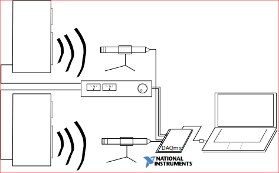

# Twingo
Twingo is a simple nidaqmx / pyAudio based, 2 channel speaker measurement application supporting continuous and finite test signals generation, acquisition and analysis.

# Installation
The easiest way to install will be to use Anaconda python distribution and by creating a conda environment.

1. Clone the project from GitHub
2. In Anaconda prompt navigate to the cloned project folder and setup conda environment from the YAML file:

    `conda env create -f environment.yml`
3. At this point you should be able to launch the application in the environment created:

    `conda activate twingo_conda_env`
    
    `python twingo.py`

_NOTE: You will not be able to install pyAudio easily using pip because it can't handle the C binaries (whatever they are) that have to go with it. This is why you do not find the familiar requirements.txt file in this repo._

---
If you wish to set up the project in pyCharm additionally follow below steps:

1. Create new project
2. Select project folder location but _do not click_ "Create" yet
3. Instead, expand "Project Interpreter" selection
    - Select "Existing Interpreter"
    - Choose the newly created conda env (twingo_conda_env) from the drop-down
4. click "Create"
You can see that you were successful by noting that in terminal the start of each line reads (twingo_conda_env) i.e. environment is activated.

# Usage and capabilities
There are two types of hardware that twingo should support right out of the box.

1. Your NIDAQmx USB based National instruments data acquisition card

    I could only test my private NI6211 M series DAQ so far but the code may well work (or require little adjustments) with any other NIDAQmx driver-based National Instruments card as long as its equipped with both analog input and output ports.
    
    
    
2. Your current system default sound device input and output 

    This is later added feature and still requires much improvement but it expands the usability of the tool to any input and output sound hardware *currently set default in your system*.
	This way its possible to use for instance:
	-   your sound card I/O,
	-   external audio interfaces (e.g. Scarlett 2i2 or 4i4 works just fine at least on the first two I/Os),
	-   external Digital/Analog converters,
	-   bluetooth speakers.

    It should work likewise on Linux and Mac, let me know!
	
	
	
    _NOTE: Your system sound drivers often have various DSP effects enabled by default that can cause strange results (most frequent offender are equalizers, echo cancellation which attempts to remove your test signal from the output since it correlates well with the input or noise cancellation that attempt to dampen white noise test) Usually though, its possible to find the sound driver config application in your system and disable these effects._

## Example analysis:
1. High resolution harmonic distortion analysis (see demo at the top of this readme)
2. Frequency response analysis with swept or white noise signal

    
3. Spectrogram for speaker / room ringing

    
    
# Note
This project is my first real OOP application after several years spent just on scientific scripting once in a while, therefore i expect that a lot of my code can be improved with your support and feedback. Thanks!

The ESS measurement method is still experimental and you should not trust the results too much.

# Acknowledgements
 - ["Python For the Lab" book by Aquiles Carattino](https://www.pythonforthelab.com/books/)
 	(without this book I'd have no clue how to structure my project)
 - [https://www.schlameel.com](https://www.schlameel.com/2017/06/09/interleaving-and-de-interleaving-data-with-python/) & [schlameel/interleave.py](https://gist.github.com/schlameel/2ee338c35c72bedcdda58dcb121f2786)
 - [Exponential Sine Sweep article from Will Fehlhaber](https://theaudioprogrammer.com/signal-analysis-ii-linear-vs-logarithmic-sine-sweep/)
 - [Qt Dark Theme by Michael Herrmann](https://github.com/pyqt/examples/tree/_/src/09%20Qt%20dark%20theme)
